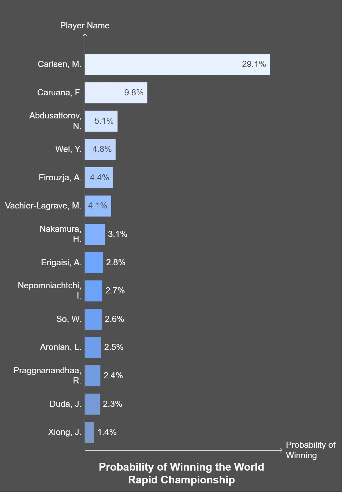
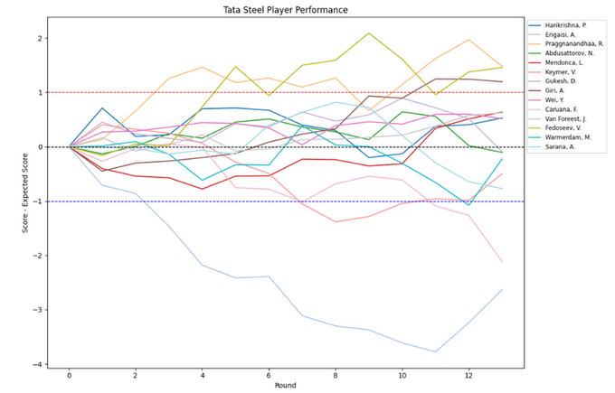
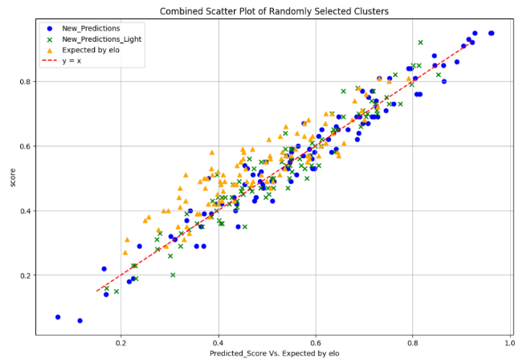

# Caissa's Word – Chess Prediction System

**Role:** Co-Founder, CTO  
**Duration:** 2023 – Present  

## 🧠 Overview

Caissa’s Word is a commercial chess prediction platform that models game outcomes, simulates tournament results, and supports strategic preparation for high-level players. Built by a small team of passionate data scientists and chess players, the system delivers state-of-the-art performance and has outperformed betting benchmarks by approximately 12% (net of commission).

---

## 🧩 Models & Capabilities

- **Flag Model**: Main prediction model, delivering best-in-class accuracy.
- **Light Model**: Optimized for speed in large tournaments.
- **Specialized Models**: Built for unique tournament formats and live conditions (e.g., Freestyle, Esports).

All models run on pre-processed historical data and player-specific inputs to predict:
- Game outcomes (win/draw/loss probabilities)
- Expected values vs Elo-based expectations
- Player trajectories across full tournaments (via Monte Carlo simulation)

---

## 🔁 Model Evolution

- Continuous feedback from Grandmasters informs output adjustments.
- Improvements are guided by competitive validation against human betting markets and real event performance.
- Custom versions of the model are developed for niche applications.

---

## 📊 Sample Output & Insights

- **Tata Steel 2025**: Predicted expectations aligned with actual performance for most players, validating model robustness even under extreme variance.
- 
- **EV vs Elo**: Our model consistently offers more realistic expectations than standard rating-based approaches.
- 
- **Strategic Reports**: Used by Grandmasters to evaluate opponent tendencies and tailor prep.

---

## 💬 Client Feedback

- Collaboration with several titled players (including GMs).
- Received qualitative insights on what elite players value when preparing — used to fine-tune both outputs and delivery format.

---

## 📌 Current Status

- Commercial use ongoing.  
- Major system update scheduled for 05/2025, expected to reduce error by 10%.  
- New capabilities in development: live game prediction, esports variants, and freestyle formats.

---

> 🚫 *Note: This repository is intended for informational purposes. Source code, model weights, and internal features are proprietary and not included.*

